# OpenFGA Authorization Model Diagram

This diagram represents the relationships and permissions defined in the OpenFGA DSL for the PurrFect Sitter application.

## Entity Relationship Diagram

```mermaid
graph TB
    %% Entity Types
    User[👤 User]
    System[🢠System]
    Cat[🱠Cat]
    CatSitting[🠠Cat Sitting]

    %% System Relations
    System -->|admin| User

    %% Cat Relations
    Cat -->|owner| User
    Cat -->|system| System
    Cat -->|admin| System

    %% Cat Sitting Relations
    CatSitting -->|sitter| User
    CatSitting -->|cat| Cat
    CatSitting -->|system| System
    CatSitting -->|admin| System

    %% Derived Relations
    Cat -.->|can_manage| User
    CatSitting -.->|owner| Cat
    CatSitting -.->|active_sitter| User
    CatSitting -.->|pending_sitter| User

    %% Legend
    subgraph Legend
        direction TB
        Direct[Direct Relation]
        Derived[Derived/Computed Relation]
        Direct --- Derived
        style Derived stroke-dasharray: 5 5
    end
```

## Permissions Matrix

## Conditional Logic Flow

### Time-based Conditions

### Status-based Conditions

## Key Relationships

### Direct Relations

- **System**: Has admin users
- **Cat**: Has an owner (user) and belongs to system
- **Cat Sitting**: Has a sitter (user), references a cat, belongs to system

### Computed Relations

- **Cat admin**: Inherited from system admin
- **Cat can_manage**: Owner OR system admin
- **Cat Sitting owner**: Derived from the associated cat's owner
- **Cat Sitting admin**: Inherited from system admin

### Conditional Relations

- **Active Sitter**: Sitter during active timeslot (current_time >= start_time AND current_time <= end_time)
- **Pending Sitter**: Sitter before timeslot starts (current_time < start_time)
- **Can Review**: Cat owner can review only if cat sitting is completed

### Permission Rules

- **can_view**: Admin OR owner OR any sitter
- **can_update**: Admin OR owner OR pending sitter
- **can_delete**: Admin OR owner OR pending sitter
- **can_post_updates**: Owner OR active sitter
- **can_review**: Cat owner (if sitting is completed)

## Concrete Examples

### Basic Cat Owner Relationship

### Cat Sitting Scenario

### Who Can Do What - Permission Example

