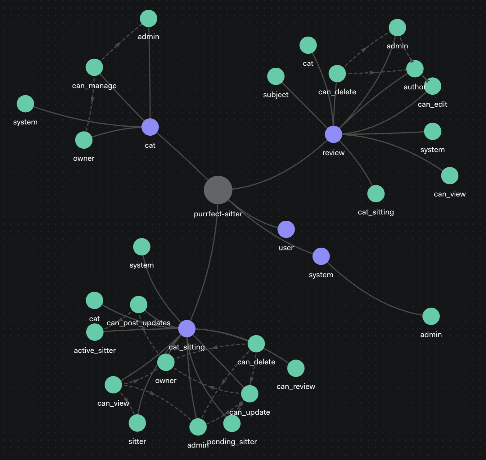

## The Authorization Problem

<!-- TODO: start with my own experience of building authorization and then, unlinke authentication ...-->

Unlike authentication, where developers can reach for well-known patterns like OAuth2/OIDC, JWT, or session-based authorization, authorization has been more of a "figure it out yourself" territory. This leads to everyone reinventing the wheel, often with increasingly complex database queries as the permissions grow.

Drowning in database queries while implementing authorization logic? You're not alone. Complex permissions quickly expose the limitations of traditional approaches.

RBAC works for simple cases but fails with nuanced permissions. ABAC offers flexibility but creates complex rule engines. Database permission checks grow unwieldy and slow as applications scale.


Enter **Relation-Based Access Control (ReBAC)** and **OpenFGA** - a powerful approach based on Google's Zanzibar paper that models permissions as relationships between entities. This makes it natural to express complex access patterns while maintaining performance at scale.

## Exploring ReBAC Through PurrfectSitter

Let's explore ReBAC through PurrfectSitter, a cat sitting app where owners find sitters. This shows how OpenFGA handles real-world authorization.

### Core Concepts of Relation-Based Access Control

ReBAC revolves around three fundamental elements:

#### Types: Objects Needing Access Control

Types are objects needing access control:

```
type user
type system
type cat
type cat_sitting
type review
```

Each type maps to an application entity:

- `user`: Person interacting with the system (owners, sitters, admins)
- `system`: Configuration defining administrative privileges
- `cat`: Profile managed by an owner
- `cat_sitting`: Arrangement between owner and sitter
- `review`: Feedback after a sitting arrangement

#### Relations: Connections Between Entities

Relations connect entities in specific ways:

```yaml
type cat
  relations
    define owner: [user]
    define admin: admin from system
    define can_manage: owner or admin
    define system: [system]
```

Relations for the `cat` type:

- `owner`: User who owns the cat
- `admin`: Inherited from system's admin relation
- `can_manage`: Permission combining owner OR admin
- `system`: Link to system entity

#### Authorization Rules: How Relationships Work

Authorization rules define how relationships can be computed:

```yaml
type cat_sitting
  relations
    define active_sitter: [cat_sitting#sitter with is_active_timeslot]
    define can_post_updates: owner or active_sitter
    define can_review: [cat#owner with is_cat_sitting_completed]
    define cat: [cat]
    define owner: owner from cat
    define sitter: [user]
```

This shows several computation methods:

- Direct assignment: `sitter: [user]` directly assigns a user as sitter
- Inheritance: `owner: owner from cat` inherits the owner relation
- Conditional relations: `active_sitter: [cat_sitting#sitter with is_active_timeslot]` uses time conditions
- Permission composition: `can_post_updates: owner or active_sitter` combines relations with OR

### OpenFGA Configuration Language

OpenFGA provides an intuitive Domain-Specific Language (DSL) for authorization rules. Here's our complete PurrfectSitter model:



```yaml
model
  schema 1.1

type user

type system
  relations
    define admin: [user]

type cat
  relations
    define admin: admin from system
    define can_manage: owner or admin
    define owner: [user]
    define system: [system]

type cat_sitting
  relations
    define active_sitter: [cat_sitting#sitter with is_active_timeslot]
    define can_post_updates: owner or active_sitter
    define can_review: [cat#owner with is_cat_sitting_completed]
    define cat: [cat]
    define owner: owner from cat
    define sitter: [user]

type review
  relations
    define admin: admin from system
    define author: owner from cat_sitting
    define can_delete: admin
    define can_edit: author
    define can_view: [user, user:*]
    define cat: cat from cat_sitting
    define cat_sitting: [cat_sitting]
    define subject: sitter from cat_sitting
    define system: [system]

condition is_active_timeslot(current_time: timestamp, end_time: timestamp, start_time: timestamp) {
  current_time >= start_time && current_time <= end_time
}

condition is_cat_sitting_completed(cat_sitting_attributes: map<string>, completed_statuses: list<string>) {
  cat_sitting_attributes["status"] in completed_statuses
}
```

This model demonstrates key OpenFGA features:

- Type definitions
- Relation definitions
- Conditional relationships
- Relationship chains

### Relationship Operators

OpenFGA supports several operators for complex authorization rules:

#### Union (OR)

```yaml
define can_manage: owner or admin
```

This grants `can_manage` permission to anyone with either `owner` or `admin` relation.

#### Inheritance (FROM)

```yaml
define owner: owner from cat
```

This inherits the `owner` relation from the related `cat` object.

#### Conditions (WITH)

```yaml
define active_sitter: [cat_sitting#sitter with is_active_timeslot]
```

This grants `active_sitter` relation only when `is_active_timeslot` condition is satisfied.

## PurrfectSitter in Action

Let's walk through a complete demo of our authorization model:

### 1. Setting Up OpenFGA

First, create a store and write the authorization model:

```bash
# Create store
fga store create --name=purrfect-sitter
fga store get --store-id=01JMSR2BKF0F1PPGBTFEY5PGAZ
export FGA_STORE_ID=01JMSR2BKF0F1PPGBTFEY5PGAZ

# Create model
fga model write --file=purrfect-sitter-model.fga
export FGA_MODEL_ID=01JMSR3QA0WAFVS7PXDTW31JVZ
fga model get
```

### 2. Creating Basic Relationships

Now establish some relationships:

```bash
# Bob owns Romeo (the cat)
fga tuple write user:bob owner cat:romeo

# Anne sits for Romeo (arrangement #1)
fga tuple write cat:romeo cat cat_sitting:1
fga tuple write user:anne sitter cat_sitting:1

# Can Bob manage Romeo's profile?
fga query check user:bob can_manage cat:romeo
# Yes (true)

# Can Anne manage someone else's cat?
fga query check user:anne can_manage cat:romeo
# No (false)
```

We've created a cat sitting arrangement where Anne cares for Bob's cat, Romeo.

### 3. Role-Based Permission with Admin Role

Add an admin role:

```bash
# Make Jenny a system admin
fga tuple write user:jenny admin system:development

# Add Romeo to the system
fga tuple write system:development system cat:romeo

# Can Jenny manage Romeo's profile?
fga query check user:jenny can_manage cat:romeo
# Yes (true)
```

This shows how ReBAC incorporates role-based access patterns. Jenny, as system admin, can manage all cats.

### 4. Time-Based Permission with Active Sitter

Conditional relationships showcase OpenFGA's true power:

```bash
# Make Anne active only during a specific time window
fga tuple write cat_sitting:1#sitter active_sitter cat_sitting:1 --condition-name is_active_timeslot --condition-context '{"start_time":"2023-01-01T00:00:00Z","end_time":"2023-01-02T00:00:00Z"}'

# Is Anne the sitter?
fga query check user:anne sitter cat_sitting:1
# Yes (true)

# Is Anne currently active (during her scheduled time)?
fga query check user:anne active_sitter cat_sitting:1 --context='{"current_time":"2023-01-01T00:09:50Z"}'
# Yes (true)

# Can Anne post updates during her active time?
fga query check user:anne can_post_updates cat_sitting:1 --context='{"current_time":"2023-01-01T12:00:00Z"}'
# Yes (true)

# Is Anne active after her scheduled time?
fga query check user:anne active_sitter cat_sitting:1 --context='{"current_time":"2023-01-03T00:09:50Z"}'
# No (false)

# Find all arrangements where Anne is active
fga query list-objects user:anne active_sitter cat_sitting --context='{"current_time":"2023-01-01T00:09:50Z"}'
# ["cat_sitting:1"]

# Find all arrangements where Bob is owner
fga query list-objects user:bob owner cat_sitting
# ["cat_sitting:1"]
```

This showcases ReBAC's power. Anne becomes an "active sitter" only during her scheduled window. Her update privileges expire automatically when her sitting time ends—no code needed to revoke permissions.

### 5. Status-Based Permissions for Reviews

Another real-world scenario involves status transitions:

```bash
# Set up review permission based on status
fga tuple write cat:romeo#owner can_review cat_sitting:1 --condition-name is_cat_sitting_completed --condition-context '{"completed_statuses":["completed"]}'

# Can Bob review while sitting is pending?
fga query check user:bob can_review cat_sitting:1 --context='{"cat_sitting_attributes":{"status": "pending"}}'
# No (false)

# Can Bob review when sitting is completed?
fga query check user:bob can_review cat_sitting:1 --context='{"cat_sitting_attributes":{"status": "completed"}}'
# Yes (true)
```

Cat owners should only review sitters after sitting is completed. OpenFGA's conditions model this business rule using a status attribute.

### 6. Creating and Checking Review Permissions

Create a review and check permissions:

```bash
# Create review
fga tuple write cat_sitting:1 cat_sitting review:1

# Make review public
fga tuple write user:* can_view review:1

# Add review to system
fga tuple write system:development system review:1

# Can Bob (cat owner) edit the review?
fga query check user:bob can_edit review:1
# Yes (true)

# Can Jenny (admin) delete the review?
fga query check user:jenny can_delete review:1
# Yes (true)

# Can Anne (sitter) delete the review?
fga query check user:anne can_delete review:1
# No (false)

# List all reviews Bob authored
fga query list-objects user:bob author review
# ["review:1"]
```

### 7. Making the Review Public

Control visibility:

```bash
# Make review public
fga tuple write user:* can_view review:1

# Is the review visible to Edouard?
fga query check user:edouard can_view review:1
# Yes (true)
```

## Testing with OpenFGA CLI

One of OpenFGA's strengths is its built-in testing capabilities. The CLI provides a declarative way to test authorization models without writing application code.

### Declarative Testing with YAML

Define tests in YAML and run with a single command:

```bash
fga model test --tests store.fga.yml
```

Key advantages:

- Test authorization before writing application code
- Verify changes without deployment
- Test complex scenarios with simple syntax
- Document your permission model

### Testing the PurrfectSitter Model

Here's how to test our model using the OpenFGA CLI:

```yaml
model: |
  model
    schema 1.1

  # Our full model definition goes here...

tuples:
  - user: user:jenny
    relation: admin
    object: system:development

  - user: user:bob
    relation: owner
    object: cat:romeo

  - user: system:development
    relation: system
    object: cat:romeo

  - user: cat:romeo
    relation: cat
    object: cat_sitting:1

  - user: user:anne
    relation: sitter
    object: cat_sitting:1

  - user: cat_sitting:1#sitter
    relation: active_sitter
    object: cat_sitting:1
    condition:
      name: is_active_timeslot
      context:
        start_time: '2023-01-01T00:00:00Z'
        end_time: '2023-01-02T00:00:00Z'

  - user: cat:romeo#owner
    relation: can_review
    object: cat_sitting:1
    condition:
      name: is_cat_sitting_completed
      context:
        completed_statuses: ['completed']

  - user: system:development
    relation: system
    object: review:1

  - user: cat_sitting:1
    relation: cat_sitting
    object: review:1

  - user: user:*
    relation: can_view
    object: review:1

tests:
  - name: Test basic relations
    check:
      - user: user:anne
        object: cat_sitting:1
        assertions:
          sitter: true

      - user: user:bob
        object: cat_sitting:1
        assertions:
          owner: true

  - name: Test role access
    check:
      - user: user:jenny
        object: cat:romeo
        assertions:
          can_manage: true

      - user: user:bob
        object: cat:romeo
        assertions:
          can_manage: true

      - user: user:anne
        object: cat:romeo
        assertions:
          can_manage: false

  - name: Test temporal access
    check:
      - user: user:anne
        object: cat_sitting:1
        context:
          current_time: '2023-01-01T00:10:00Z'
        assertions:
          active_sitter: true

      - user: user:anne
        object: cat_sitting:1
        context:
          current_time: '2023-01-04T00:00:00Z'
        assertions:
          active_sitter: false

  - name: Test attribute access
    check:
      - user: user:bob
        object: cat_sitting:1
        context:
          cat_sitting_attributes:
            status: 'completed'
        assertions:
          can_review: true

      - user: user:bob
        object: cat_sitting:1
        context:
          cat_sitting_attributes:
            status: 'in_progress'
        assertions:
          can_review: false

  - name: Test the cat sitting that anne is sitting
    list_objects:
      - user: user:anne
        type: cat_sitting
        context:
          current_time: '2023-01-01T00:00:01Z'
        assertions:
          active_sitter:
            - cat_sitting:1
          sitter:
            - cat_sitting:1

  - name: Test the review that bob can edit
    list_objects:
      - user: user:bob
        type: review
        assertions:
          can_edit:
            - review:1

  - name: Test that reviews are public
    list_users:
      - object: review:1
        user_filter:
          - type: user
        assertions:
          can_view:
            users:
              - user:*
```

### Test Types

The example demonstrates several test types:

1. **Basic permission checks**: Simple assertions about relationships
2. **Contextual checks**: Testing time-based permissions
3. **Attribute-based checks**: Testing permissions depending on object attributes
4. **List objects**: Finding objects a user has relationships with
5. **List users**: Finding users with relationships to an object

### Testing During Adoption

These testing capabilities help when adopting OpenFGA:

- Validate models against business rules
- Verify permissions match the old system during migration
- Compare results with your existing system in shadow mode
- Prevent regressions with CI pipeline tests

Including tests in your workflow reduces authorization errors and builds confidence in your implementation.

## Best Practices for Authorization Models

Our PurrfectSitter example demonstrates key best practices:

### 1. Start Simple

Begin with core entities and relationships. We started with users, cats, and ownership.

### 2. Model Natural Hierarchies

Our relationships reflect the domain's natural structure:

- Cats belong to owners
- Cat sittings involve cats and sitters
- Reviews connect to cat sitting arrangements

### 3. Leverage Inheritance

Use inheritance to reduce duplication:

```yaml
define owner: owner from cat
```

This keeps the model maintainable.

### 4. Use Conditions for Dynamic Rules

Implement time-based and status-based rules with conditions instead of complex application logic.

### 5. Think in Relationships

Model everything as relationships instead of boolean flags. This makes authorization intuitive and maintainable.

## Benefits of ReBAC and OpenFGA

ReBAC and OpenFGA offer these advantages:

### Models Mirror Reality

Authorization models mirror real-world relationships: owners have cats, cats have sitters, sitters receive reviews. This makes rules intuitive and maintainable.

### Automatic Time Constraints

Time-based permissions are handled declaratively through conditions, eliminating complex grant/revoke logic.

### Status-Based Access

Business workflows often depend on status. OpenFGA restricts actions like reviews based on status without hardcoding rules in your application.

### Relationship Queries

Beyond yes/no checks, OpenFGA lets you query relationships. Find all reviews a user wrote or received—beyond what traditional systems offer.

### Scale and Performance

Permission checks don't rely on complex database queries, so they scale efficiently as data grows. Google's Zanzibar system, which inspired OpenFGA, handles billions of checks daily.

## Adoption Challenges and Strategies

Adopting OpenFGA in existing systems presents challenges. Here's how to address them:

### Mental Model Shift

ReBAC requires a paradigm shift for developers:

- **Mental model adjustment**: Developers familiar with RBAC or ABAC need time to think in relationships.
- **Training investment**: Workshops and examples help teams translate existing rules into relationship models.

### Data Synchronization

Maintaining data consistency presents challenges:

- **Dual writes**: Applications must write to both their database and OpenFGA.
- **Synchronization strategies**:
  - Event-driven synchronization through message queues
  - Centralized hooks for database operations
  - Transactional outbox pattern for consistency
  - Background jobs for existing data

> Note: Read this excellent article about handling dual writes with OpenFGA [here](https://auth0.com/blog/handling-the-dual-write-problem-in-distributed-systems/). It provides practical strategies for synchronizing data between your application and OpenFGA.

### Progressive Adoption

Introduce OpenFGA incrementally:

#### 1. Start with Coarse-Grained Permissions

Begin with your existing structure:

- Replicate your current RBAC model
- Add organization-level permissions
- Gradually introduce finer-grained controls

#### 2. Shadow Mode Implementation

Before switching fully:

- Run existing authorization alongside OpenFGA
- Compare results to identify discrepancies
- Build confidence before making the switch

#### 3. Use Contextual Tuples for Hybrid Implementations

Reduce synchronization burden:

- Send data as contextual tuples initially
- Gradually move to persistent relationship tuples
- Use contextual tuples for frequently changing data

#### 4. Domain-Specific Authorization Services

Wrap OpenFGA with domain-specific services:

- Create organization-specific API endpoints
- Provide familiar interfaces to developers
- Centralize contextual data retrieval

### Managing Organizational Adoption

For large organizations:

- Start with a single application where OpenFGA delivers immediate value
- Use modular models for independent team control
- Leverage access control for team-specific credentials

## Conclusion

PurrfectSitter shows how OpenFGA and ReBAC elegantly solve complex authorization problems. Modeling permissions as relationships creates systems that are intuitive, maintainable, and performant.

Building a cat sitting app or enterprise platform? ReBAC and OpenFGA tame your authorization challenges.

For more information, visit the [OpenFGA documentation](https://openfga.dev/) or check out the complete code at github.com/getlarge/purrfect-sitter.

---

Zanzibar Academy https://zanzibar.academy
Google's Zanzibar Paper (2019) https://research.google/pubs/zanzibar-googles-consistent-global-authorization-system/
